<div align="center">

</div>

<br/>

<div align="center">

[](https://threejs.org)
[](https://rapier.rs)
[](https://vitejs.dev)
[](https://developer.mozilla.org/en-US/docs/Web/API/WebGPU_API)
[](#)

</div>

---

## Qué es esto

**ANT ON MARS** es un juego 3D experimental que vive en el browser. Sin motor de juego, sin Unity, sin Unreal — solo **Three.js WebGPU**, **Rapier physics** compilado desde Rust, y Vanilla JavaScript puro.

El concepto es simple: un vehículo en un terreno marciano procedural infinito. La ejecución no lo es tanto. Física real de suspensión con cuatro ruedas independientes, heightfield collision que se construye incrementalmente, noise seeded para que el terreno sea reproducible, y 60+ modelos GLB generados con Meshy AI que se pueden intercambiar en caliente sin recargar la página.

Es un proyecto de exploración técnica y estética al mismo tiempo. Cada decisión tiene doble propósito: que funcione bien y que se sienta bien.


## Features

<table>
<tr>
<td align="center" width="33%">
<br/>
<b>🚗 Física de Vehículo Real</b>
<br/><br/>
<sub>Cuatro ruedas con suspensión independiente, amortiguación configurable, steering con ackermann approximation y torque distribuido. Rapier3D maneja el rigid body, las constraints y los raycasts de suspensión. Se siente pesado, no flotante.</sub>
<br/><br/>
</td>
<td align="center" width="33%">
<br/>
<b>🌍 Terreno Procedural</b>
<br/><br/>
<sub>ImprovedNoise con seed configurable genera el heightmap. El collider de Rapier se construye como heightfield incremental — solo la zona activa alrededor del vehículo tiene colisión activa. El terreno es infinito en teoría, limitado por la memoria en la práctica.</sub>
<br/><br/>
</td>
<td align="center" width="33%">
<br/>
<b>📦 60+ GLB Assets</b>
<br/><br/>
<sub>Todos los modelos viven en `public/GLB/` y se catalogan automáticamente via `manifest.json`. El flag `USE_CUSTOM_VEHICLE_GLB` activa el hot-swap: cambiás el GLB del vehículo sin recargar. Generados con Meshy AI: vans, ruedas, paisajes, estructuras.</sub>
<br/><br/>
</td>
</tr>
<tr>
<td align="center" width="33%">
<br/>
<b>⚡ WebGPU Renderer</b>
<br/><br/>
<sub>Three.js WebGPURenderer experimental con fallback automático a WebGL. Stats-GL overlay muestra FPS, draw calls y memoria de GPU en tiempo real. El renderer está configurado para tone mapping y shadow maps de alta resolución.</sub>
<br/><br/>
</td>
<td align="center" width="33%">
<br/>
<b>🎮 Event System</b>
<br/><br/>
<sub>EventBus pub/sub completamente desacoplado. Cada módulo emite y escucha eventos sin referencias directas entre sí. InputManager traduce eventos del teclado a acciones nombradas. Preparado para agregar gamepad sin tocar el código del vehículo.</sub>
<br/><br/>
</td>
<td align="center" width="33%">
<br/>
<b>🔧 Migración Modular</b>
<br/><br/>
<sub>El juego arrancó como un `main.js` de 3000+ líneas. La migración en curso separa Engine, PhysicsWorld, GameLoop, NoiseGenerator, VehicleController en módulos independientes. Cada uno tiene un contrato claro y no sabe de los otros salvo por el EventBus.</sub>
<br/><br/>
</td>
</tr>
</table>


## Gallery

<table>
<tr>
<td width="50%"></td>
<td width="50%"></td>
</tr>
</table>

<br/>

<table>
<tr>
<td width="33%"></td>
<td width="33%"></td>
<td width="33%"></td>
</tr>
</table>


## Stack

```
Three.js v0.183       →  Renderer WebGPU + WebGL fallback + GLTFLoader
@dimforge/rapier3d    →  Physics engine WASM (compilado desde Rust)
Vite 8.0              →  Dev server HMR + bundler con aliases @core @physics
stats-gl              →  GPU performance overlay en runtime
Meshy AI              →  Generación procedural de assets GLB
```

## Arquitectura

```
ant-on-mars/
├── index.html                    # UI shell — todos los elementos HTML viven aquí
├── src/
│   ├── main.js                   # Entry point (monolith en migración modular)
│   ├── style.css                 # Todo el CSS — glass panels, HUD, responsive
│   ├── core/
│   │   ├── Engine.js             # Three.js: escena, cámara, renderer, luces, shadows
│   │   ├── EventBus.js           # Pub/sub desacoplado — único canal de comunicación
│   │   ├── GameLoop.js           # Fixed timestep 60Hz physics + variable render Hz
│   │   └── InputManager.js       # Keyboard state + emisión de eventos nombrados
│   ├── physics/
│   │   ├── PhysicsWorld.js       # Rapier world wrapper — gravity, step, debug renderer
│   │   ├── VehicleController.js  # Ruedas, suspensión, steering, torque, handbrake
│   │   └── Heightfield.js        # Terrain collider incremental — solo zona activa
│   └── terrain/
│       └── NoiseGenerator.js     # ImprovedNoise seeded para heightmap reproducible
└── public/
    └── GLB/
        ├── manifest.json         # Catálogo auto-cargado — registrar aquí los nuevos GLBs
        ├── DEFAULTS/             # Modelos default de vehículo y objetos base
        └── [60+ .glb files]      # Assets Meshy AI — todo lo que aparece en el mundo
```

## GLB Assets

```bash
# Agregar un modelo nuevo:
# 1. Copiar archivo .glb a public/GLB/
# 2. Registrar en public/GLB/manifest.json
# 3. Hot-swap en runtime: activar USE_CUSTOM_VEHICLE_GLB en config

# Assets incluidos:
# vans (naranja, roja, mundos, satélite)
# ruedas (blanca, comprimida)
# entornos (coast, lava, nieve, rally, La Bombonera)
# objetos (manos en montaña, mate, metal hands)
```

## Correr local

```bash
npm install
npm run dev      # → http://localhost:5173  (HMR activo)
npm run build    # → dist/  (bundle optimizado con terser)
npm run preview  # → preview del build final
```

## Docs

| | |
|---|---|
| [`ARCHITECTURE.md`](docs/ARCHITECTURE.md) | Arquitectura completa del sistema |
| [`CONTEXT.md`](docs/CONTEXT.md) | Guía de contexto para AI prompting |
| [`FLOW_TIME.md`](docs/FLOW_TIME.md) | Game loop, timers y física |
| [`UI_SYSTEMS.md`](docs/UI_SYSTEMS.md) | Componentes de UI y HUD |
| [`FUTURE_ROADMAP.md`](docs/FUTURE_ROADMAP.md) | Features planeados |
| [`HUMAN_MANIFEST.md`](docs/HUMAN_MANIFEST.md) | Manifiesto del proyecto |

<br/>


